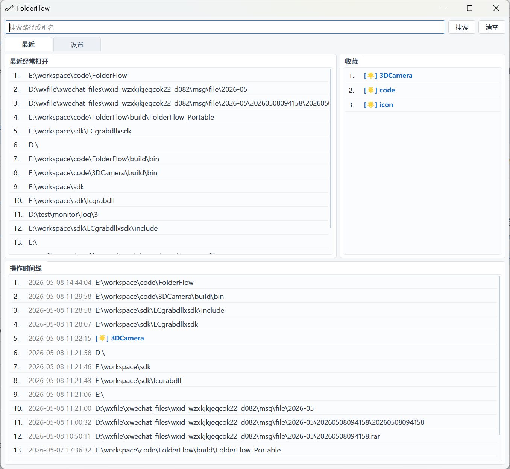

本项目由 OpenAI Codex 应用协助开发，使用 GPT-5 系列模型完成代码实现、调试与整理。

# FolderFlow

FolderFlow is a lightweight Windows desktop utility for tracking and quickly opening frequently used folders.

FolderFlow 是一个 Windows 桌面文件夹访问助手，用来自动记录、整理并快速打开常用目录。



## Why / 为什么

If you often switch between project folders, build folders, download folders, or asset folders, FolderFlow helps you find them again without digging through File Explorer history or bookmarks.

如果你经常在项目目录、构建目录、下载目录、素材目录之间切换，FolderFlow 可以帮你自动整理这些常用路径，让你更快回到刚才或经常使用的目录。

## Features / 功能

- Auto-track the active Windows File Explorer folder.
- 自动记录当前前台资源管理器目录。
- Timeline for recently visited folders.
- 最近访问时间线。
- Hot ranking based on access count and freshness.
- 根据访问次数和新鲜度生成常用排行。
- Favorites with custom aliases.
- 收藏目录并设置别名。
- Search by path or alias.
- 按路径或别名搜索。
- Compact mode and full mode switch from the main window.
- 可在主界面切换精简模式和全量模式；精简模式只保留搜索栏和时间线，更适合作为快捷工具。
- Open folders in Command Prompt with an optional environment script, such as Qt `qtenv2.bat` or Visual Studio `VsDevCmd.bat`.
- 支持配置命令行环境脚本，在右键菜单中以 Qt 或 Visual Studio 临时环境打开目录。
- Drive root paths are ignored automatically.
- 自动排除盘符根目录，不入库也不展示。
- Tray mode and global shortcut.
- 托盘运行和全局快捷键。

## Shortcuts / 快捷键

| Shortcut | Action |
| --- | --- |
| `Ctrl + Space` | Show or hide FolderFlow / 显示或隐藏 |
| `Ctrl + L` | Focus search / 聚焦搜索 |
| `Alt + 1..6` | Open timeline item 1-6 / 打开时间线前 6 项 |
| `Enter` | Search / 搜索 |
| `Esc` | Clear search or hide / 清空搜索或隐藏 |

## Build / 构建

Requirements:

- Windows
- Qt 5.15.x for MSVC
- Visual Studio 2019 C++ toolchain

Build with qmake:

```powershell
qmake FolderFlow.pro
nmake
```

Or open `FolderFlow.pro` in Qt Creator and build with an MSVC Qt kit.

也可以在 Qt Creator 中打开 `FolderFlow.pro`，选择 MSVC Qt Kit 后构建运行。

## Notes / 说明

- Runtime data is stored through Qt `QStandardPaths`.
- 运行数据通过 Qt `QStandardPaths` 保存在用户本地目录。
- Build outputs such as `build/`, `debug/`, `release/`, `*.exe`, and `*.pdb` are ignored.
- `build/`、`debug/`、`release/`、`*.exe`、`*.pdb` 等构建产物不会提交到仓库。

## Dependencies / 依赖

- Qt Widgets
- Qt SQL
- Windows Shell/COM APIs
- [QHotkey](https://github.com/Skycoder42/QHotkey)
